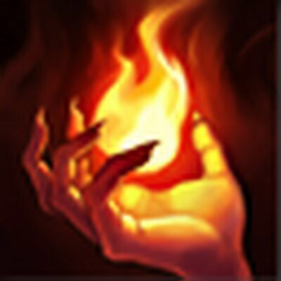
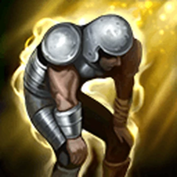
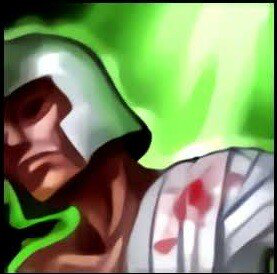
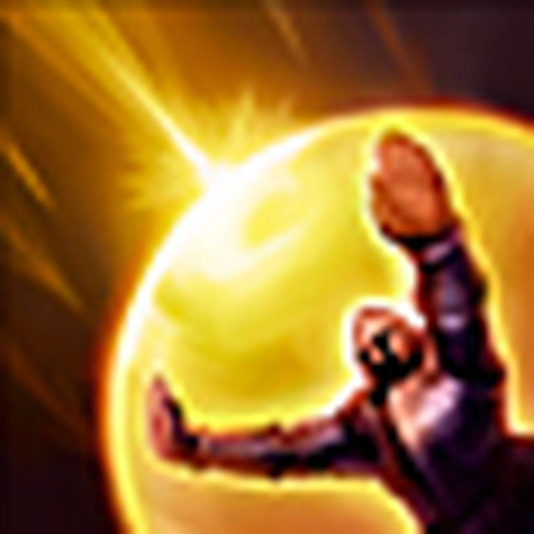
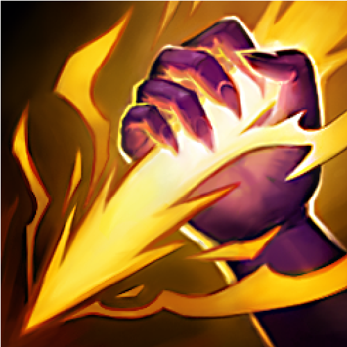

# Summoners Rift Fabric Mod

This mod is an implementation of summoner spells in the popular game [League of Legends](https://www.leagueoflegends.com/), brought into [Minecraft](https://www.minecraft.net/) via the [Fabric](https://fabricmc.net/) modding platform.

---

## Table of Contents

- [Features](#features)
- [Tech Stack](#tech-stack)
- [What Each Item Does](#what-each-item-does)
- [Recipes](#recipes)
- [Getting Started](#getting-started)
- [Usage](#usage)
- [Item Showcase](#item-showcase)
- [Contributing](#contributing)
- [Credits](#credits)
- [License](#license)

---

## Features

- Adds iconic Summoner Spells as items, including:
  - Flash&nbsp;
  - Ignite&nbsp;
  - Exhaust&nbsp;
  - Ghost&nbsp;
  - Cleanse&nbsp;
  - Heal&nbsp;
  - Barrier&nbsp;
  - Smite&nbsp;
- Each spell is represented as a unique item with effects similar to their League of Legends counterparts.
- Custom item group for easy access in creative mode.
- Custom sounds and particle effects for spell activation.
- All items have crafting recipes.

---

## Tech Stack

- [Minecraft](https://www.minecraft.net/) **1.21.4**
- [Java](https://www.oracle.com/java/technologies/downloads/) **21** or later
- [Fabric Loader](https://fabricmc.net/) **>=0.16.10**
- [Fabric API](https://modmuss50.me/fabric.html) (compatible with 1.21.4)
- [Gradle](https://gradle.org/) for building

---

## What Each Item Does

| Spell    | Effect |
|----------|--------|
| **Barrier**  | Grants absorption (2 yellow hearts) for 2.5 seconds and sets a 4 second cooldown. |
| **Cleanse**  | Clears all status effects from the player and sets a 10 second cooldown. |
| **Exhaust**  | Applies Slowness and Weakness to the target entity for 10 seconds and sets a 15 second cooldown. |
| **Flash**  | Teleports you up to 5 blocks in the direction you're facing, only if the destination is viable (will reduce distance if blocked). Sets a 1 second cooldown. |
| **Ghost**  | Grants Speed to the player for 10 seconds and sets a 15 second cooldown. |
| **Heal**  | Heals all players in a 10 block radius for 1.5 hearts and sets a 10 second cooldown. |
| **Ignite**  | Sets the target entity on fire for 10 seconds, temporarily sets the player's food level to half (to prevent regeneration), then restores hunger. Sets a 15 second cooldown. |
| **Smite**  | Deals 2.5 hearts of damage to the target entity and sets a 15 second cooldown. |

- All items feature custom sound effects on use.
- Several spells have unique particle effects (see showcase videos below).

---

## Recipes

**All items have crafting recipes. Here are the visual patterns:**

- **Barrier** :  
  <table>
    <tr>
      <td></td>
      <td></td>
    </tr>
    <tr>
      <td></td>
      <td></td>
    </tr>
  </table>
> Uses 4 iron nuggets in a 2x2 pattern.

---

- **Cleanse** :  
  <table>
    <tr>
      <td></td>
      <td></td>
    </tr>
    <tr>
      <td></td>
      <td></td>
    </tr>
  </table>
> Uses 4 iron ingots in a 2x2 pattern.

---

- **Exhaust** :  
  <table>
    <tr>
      <td></td>
      <td></td>
      <td></td>
    </tr>
    <tr>
      <td></td>
      <td></td>
      <td></td>
    </tr>
    <tr>
      <td></td>
      <td></td>
      <td></td>
    </tr>
  </table>
> Uses 9 feathers in a 3x3 pattern.

---

- **Flash** :  
  <table>
    <tr>
      <td></td>
      <td></td>
      <td></td>
    </tr>
    <tr>
      <td></td>
      <td></td>
      <td></td>
    </tr>
    <tr>
      <td></td>
      <td></td>
      <td></td>
    </tr>
  </table>
> Uses blaze powder, glowstone dust, and an ender pearl in a custom 3x3 pattern.

---

- **Ghost** :  
  <table>
    <tr>
      <td></td>
      <td></td>
    </tr>
    <tr>
      <td></td>
      <td></td>
    </tr>
  </table>
> Uses 4 gold ingots in a 2x2 pattern.

---

- **Heal** :  
  <table>
    <tr>
      <td></td>
      <td></td>
    </tr>
    <tr>
      <td></td>
      <td></td>
    </tr>
  </table>
> Uses 4 netherite ingots in a 2x2 pattern.

---

- **Ignite** :  
  
> Uses a single flint_and_steel as the ingredient.

---

- **Smite** :  
  <table>
    <tr>
      <td></td>
      <td></td>
    </tr>
    <tr>
      <td></td>
      <td></td>
    </tr>
  </table>
> Uses 4 gold nuggets in a 2x2 pattern.


## Getting Started

### Requirements

- **[Minecraft](https://www.minecraft.net/):** 1.21.4
- **[Java](https://www.oracle.com/java/technologies/downloads/):** 21 or later
- **[Fabric Loader](https://fabricmc.net/):** >=0.16.10
- **[Fabric API](https://modmuss50.me/fabric.html):** Compatible version for 1.21.4

### Installation

1. Download the latest release of the mod from the [Releases](https://github.com/TheSebitzu/Summoners-Rift/releases) page.
2. Place the `.jar` file in your `mods` folder.
3. Ensure you have Fabric Loader and Fabric API installed.

### Building from Source

1. Clone the repository:
   ```bash
   git clone https://github.com/TheSebitzu/Summoners-Rift.git
   cd Summoners-Rift
   ```
2. Build the mod using Gradle:
   ```bash
   ./gradlew build
   ```
3. The compiled mod can be found in `build/libs/`.

---

## Usage

- Find the new Summoner Spell items in the dedicated `Summoners Rift` creative tab.
- Use each item to activate effects such as teleporting (Flash), damaging enemies (Ignite), applying debuffs (Exhaust), or healing (Heal), among others.
- All items feature custom sounds and many have unique particle effects for extra immersion.

---

## Item Showcase

Below are demonstration videos for each Summoner Spell item:

| Spell    | Video |
|----------|-------|
| **Barrier**  | <video src="showcase_videos/barrier.mp4" width="300" autoplay loop muted alt="Barrier video">Sorry, your browser doesn't support embedded videos. [Download video](showcase_videos/barrier.mp4).</video> |
| **Cleanse**  | <video src="showcase_videos/cleanse.mp4" width="300" autoplay loop muted alt="Cleanse video">Sorry, your browser doesn't support embedded videos. [Download video](showcase_videos/cleanse.mp4).</video> |
| **Exhaust**  | <video src="showcase_videos/exhaust.mp4" width="300" autoplay loop muted alt="Exhaust video">Sorry, your browser doesn't support embedded videos. [Download video](showcase_videos/exhaust.mp4).</video> |
| **Flash**  | <video src="showcase_videos/flash.mp4" width="300" autoplay loop muted alt="Flash video">Sorry, your browser doesn't support embedded videos. [Download video](showcase_videos/flash.mp4).</video> |
| **Flash (through blocks)**  | <video src="showcase_videos/flash_through_blocks.mp4" width="300" autoplay loop muted alt="Flash through blocks video">Sorry, your browser doesn't support embedded videos. [Download video](showcase_videos/flash_through_blocks.mp4).</video> |
| **Ghost**  | <video src="showcase_videos/ghost.mp4" width="300" autoplay loop muted alt="Ghost video">Sorry, your browser doesn't support embedded videos. [Download video](showcase_videos/ghost.mp4).</video> |
| **Heal**  | <video src="showcase_videos/heal1.mp4" width="300" autoplay loop muted alt="Heal video (single player)">Sorry, your browser doesn't support embedded videos. [Download video](showcase_videos/heal1.mp4).</video> |
| **Heal (2nd player)**  | <video src="showcase_videos/heal2.mp4" width="300" autoplay loop muted alt="Heal video (two players)">Sorry, your browser doesn't support embedded videos. [Download video](showcase_videos/heal2.mp4).</video> |
| **Ignite**  | <video src="showcase_videos/ignite.mp4" width="300" autoplay loop muted alt="Ignite video">Sorry, your browser doesn't support embedded videos. [Download video](showcase_videos/ignite.mp4).</video> |
| **Smite**  | <video src="showcase_videos/smite.mp4" width="300" autoplay loop muted alt="Smite video">Sorry, your browser doesn't support embedded videos. [Download video](showcase_videos/smite.mp4).</video> |

> *Note*: If videos do not appear, you can download them directly from the [`showcase_videos`](showcase_videos) directory.

---

## Contributing

Contributions, suggestions, and bug reports are welcome!  
If you'd like to contribute, please fork the repository, create a new branch, and submit a pull request.  
For major changes, open an issue first to discuss what you would like to change.

---

## Credits

- **Author:** Sebitzu
- Inspired by [League of Legends](https://www.leagueoflegends.com/) and built using the [Fabric](https://fabricmc.net/) modding toolchain.

---

## License

This project is licensed under the CC0-1.0 License.

---

> **Note**: *This mod is not affiliated with or endorsed by Riot Games or Mojang Studios or their respective trademarks.*